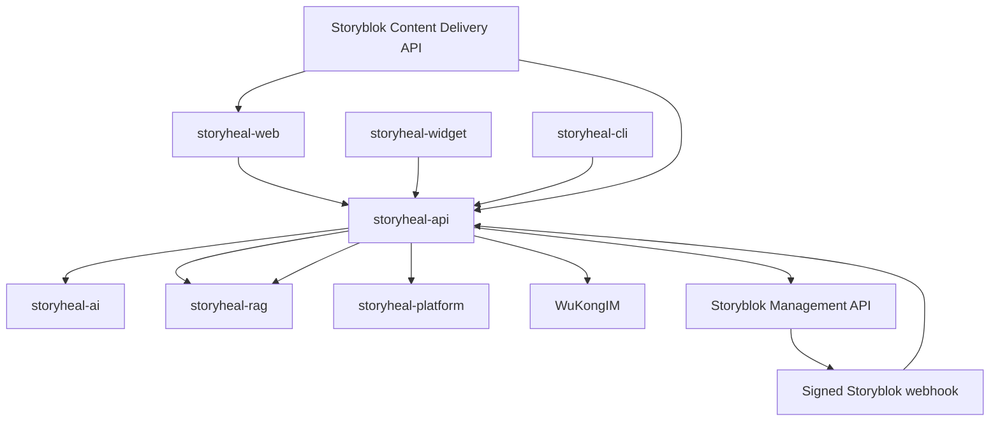

# StoryHeal Workspace — AGENTS.md

## Required verification

- Use `implementation-strategy` before broad runtime/API changes.
- Use `db-migration-check` when SQLAlchemy models change.
- Use `cross-service-sync` when schemas, API response types, or shared contracts change.
- Use `streaming-protocol-check` for SSE, WuKongIM, or citation-stream changes.
- Use `code-change-verification` before completing code changes.
- Use `local-services` before runtime smoke tests and `functional-verification` when the stack is available.
- Use `pr-draft-summary` for the final code-change handoff.

## Architecture



## Services

| Service | Directory | Role |
|---|---|---|
| storyheal-api | `repos/storyheal-api` | Core API, knowledge loop, Storyblok integration, RBAC and analytics |
| storyheal-ai | `repos/storyheal-ai` | Typed knowledge agents and OpenAI-compatible/Ollama model runtime |
| storyheal-rag | `repos/storyheal-rag` | pgvector retrieval and canonical Storyblok external sources |
| storyheal-platform | `repos/storyheal-platform` | Channel and message synchronization |
| storyheal-web | `repos/storyheal-web` | Admin, review, analytics and public help-center UI |
| storyheal-widget | `repos/storyheal-widget` | Visitor chat widget with citations and usefulness feedback |
| storyheal-cli | `repos/storyheal-cli` | Staff operations and MCP-compatible command interface |

Infrastructure: PostgreSQL/pgvector, Redis, Celery, WuKongIM, Nginx, and optional Ollama.

## Constraints

- Keep Storyblok published content canonical for every channel; never index a draft payload.
- No agent may publish without a persisted human approval decision.
- Never expose Storyblok Management credentials to browsers or API responses.
- No cross-service direct database access; use authenticated HTTP APIs.
- No bare `dict` or TypeScript `any` in business interfaces.
- No hardcoded credentials or deployment addresses.
- Model/table changes require an Alembic migration in the same change.
- Preserve inherited notices only under `THIRD_PARTY_NOTICES/`.

## Quick start

```bash
cp .env.example .env
docker compose up --build
```

For HTTPS, provide certificates in `data/certs/` and add `-f docker-compose.https.yml`.
